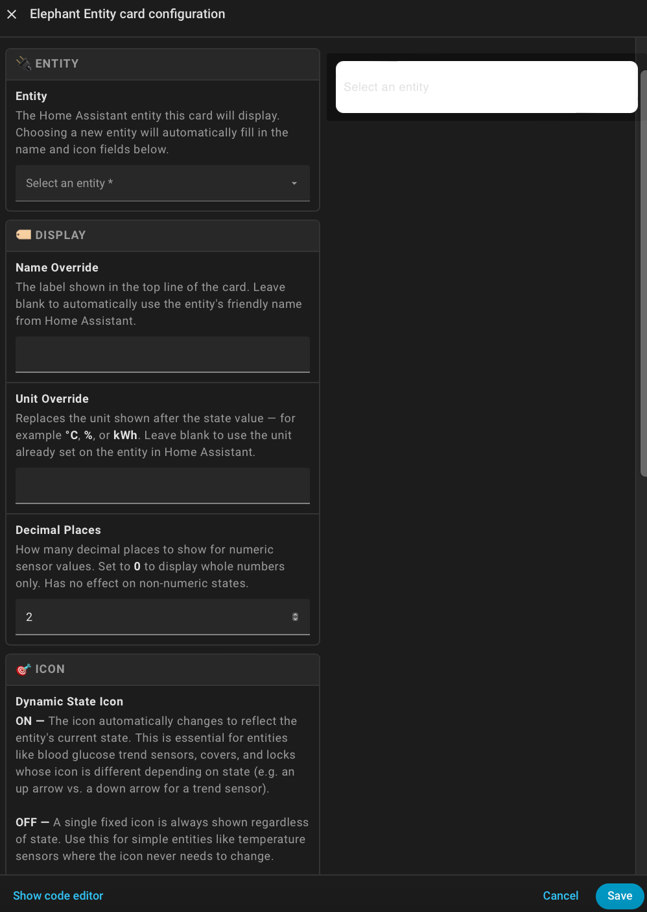

# 🐘 Elephant Entity Card

A compact, customisable entity card for [Home Assistant](https://www.home-assistant.io/) with smart icon mapping and automatic entity population.




---

## Features

- **Auto-population** — When you select an entity, the name and icon are automatically filled in from Home Assistant attributes
- **Smart icon mapping** — Domain and device class aware icon selection out of the box (lights, sensors, locks, covers, binary sensors and more)
- **State-aware colouring** — Icons reflect active/inactive state using your HA theme colours, or you can override with a custom colour
- **Full colour customisation** — Set background, text and icon colours individually using the colour picker in the visual editor
- **Transparency control** — Adjust card background opacity with a slider
- **Decimal precision** — Choose how many decimal places are shown for numeric sensor values
- **Offline awareness** — Unavailable or unknown entities are clearly shown as "Offline"
- **Friendly state labels** — Binary sensors, locks, doors and windows display human-readable states (Open/Closed, Locked/Unlocked, Detected/Clear)

---

## Installation

### HACS (Recommended)

1. Open **HACS** in your Home Assistant sidebar
2. Go to **Frontend**
3. Click the **+ Explore & Download Repositories** button
4. Search for **Elephant Entity Card**
5. Click **Download**
6. Reload your browser

### Manual

1. Download `elephant-entity-card.js` from the [latest release](https://github.com/jamesmcginnis/elephant-entities-card/releases)
2. Copy it to your `config/www/` folder
3. Add the following to your **Dashboard Resources** (Settings → Dashboards → Resources):

```
URL:  /local/elephant-entity-card.js
Type: JavaScript module
```

4. Reload your browser

---

## Usage

Add the card via the **visual editor** or directly in YAML.

### Visual Editor

1. Edit a dashboard and click **+ Add Card**
2. Search for **Elephant Entity Card**
3. Select your entity — name and icon will auto-populate
4. Customise colours, transparency and decimal places as needed

### YAML

```yaml
type: custom:elephant-entity-card
entity: sensor.living_room_temperature
name: Living Room
unit: °C
decimals: 1
icon: mdi:thermometer
background_color: "#1a1a2e"
text_color: "#ffffff"
icon_color: "#e94560"
transparency: 0.85
state_color: false
```

---

## Configuration Options

| Option | Type | Default | Description |
|---|---|---|---|
| `entity` | `string` | **Required** | The entity ID to display |
| `name` | `string` | Entity friendly name | Override the display name |
| `unit` | `string` | Entity unit | Override the unit of measurement |
| `icon` | `string` | Auto-mapped MDI icon | Override the icon (e.g. `mdi:lightbulb`) |
| `decimals` | `number` | `2` | Decimal places for numeric states |
| `background_color` | `string` or `[r,g,b]` | HA card default | Card background colour |
| `text_color` | `string` or `[r,g,b]` | HA primary text | Text colour |
| `icon_color` | `string` or `[r,g,b]` | Inherited | Icon colour (only when `state_color: false`) |
| `transparency` | `number` (0–1) | `1` | Background opacity |
| `state_color` | `boolean` | `true` | Use HA theme active/inactive colours for the icon |

---

## Supported Domains & Icons

The card automatically selects an appropriate icon based on the entity's domain and device class:

| Domain | Device Class | Icon |
|---|---|---|
| `light` | — | `mdi:lightbulb` |
| `switch` | `outlet` | `mdi:power-plug` |
| `switch` | — | `mdi:toggle-switch` |
| `sensor` | `temperature` | `mdi:thermometer` |
| `sensor` | `humidity` | `mdi:water-percent` |
| `sensor` | `battery` | `mdi:battery` |
| `sensor` | `power` | `mdi:flash` |
| `sensor` | `energy` | `mdi:lightning-bolt` |
| `sensor` | `illuminance` | `mdi:brightness-5` |
| `sensor` | `pressure` | `mdi:gauge` |
| `binary_sensor` | `door` / `garage_door` / `opening` | `mdi:door-open` / `mdi:door-closed` |
| `binary_sensor` | `window` | `mdi:window-open` / `mdi:window-closed` |
| `binary_sensor` | `motion` / `presence` / `occupancy` | `mdi:motion-sensor` |
| `binary_sensor` | `moisture` | `mdi:water-alert` |
| `binary_sensor` | `smoke` | `mdi:smoke-detector` |
| `lock` | — | `mdi:lock` / `mdi:lock-open` |
| `climate` | — | `mdi:thermostat` |
| `cover` | — | `mdi:window-shutter` |
| `media_player` | — | `mdi:cast` |
| `fan` | — | `mdi:fan` |
| `person` | — | `mdi:account` |
| `weather` | — | `mdi:weather-cloudy` |

---

## Contributing

Pull requests are welcome! Please open an issue first to discuss any significant changes.

---

## Licence

This project is licensed under the [MIT Licence](LICENSE).
