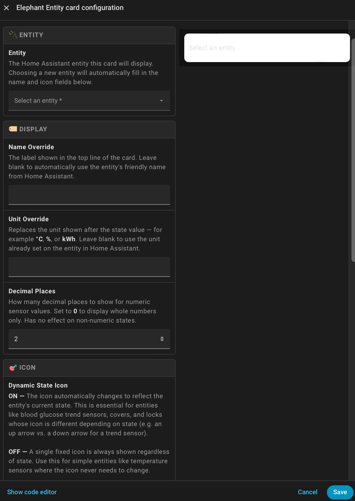

# 🐘 Elephant Entity Card

*** CUSTOM  DASHBOARD CARD, DESIGN FOR ONE SPECIFIC USER ***

[](https://github.com/hacs/integration)

A compact Home Assistant entity card with dynamic icons and full colour control.

## Installation

### HACS (Recommended)

[](https://my.home-assistant.io/redirect/hacs_repository/?owner=jamesmcginnis&repository=elephant-entities-card&category=plugin)

1. Click the button above, or open HACS → Frontend → ⋮ → Custom repositories and add this repository.
1. Search for **Elephant Entity Card** and install it.
1. Restart Home Assistant.

### Manual

1. Download `elephant-entity-card.js` and place it in `/config/www/`.
1. Add it as a resource: **Settings → Dashboards → ⋮ → Resources → Add resource** with URL `/local/elephant-entity-card.js` and type **JavaScript module**.
1. Restart Home Assistant.

## Preview




## Configuration

|Option            |Type     |Default     |Description                            |
|------------------|---------|------------|---------------------------------------|
|`entity`          |string   |**required**|The entity to display                  |
|`name`            |string   |—           |Override the display name              |
|`unit`            |string   |—           |Override the unit of measurement       |
|`decimals`        |number   |`2`         |Decimal places for numeric values      |
|`use_dynamic_icon`|boolean  |`false`     |Automatically change icon with state   |
|`icon`            |string   |—           |Fixed MDI icon (e.g. `mdi:thermometer`)|
|`state_color`     |boolean  |`true`      |Colour icon green/grey based on state  |
|`background_color`|RGB array|—           |Card background colour                 |
|`text_color`      |RGB array|—           |Card text colour                       |
|`icon_color`      |RGB array|—           |Icon colour (when `state_color` is off)|
|`transparency`    |number   |`1`         |Background opacity (0.0 – 1.0)         |

## Example

```yaml
type: custom:elephant-entity-card
entity: sensor.living_room_temperature
name: Living Room
decimals: 1
state_color: true
```

## License

MIT
